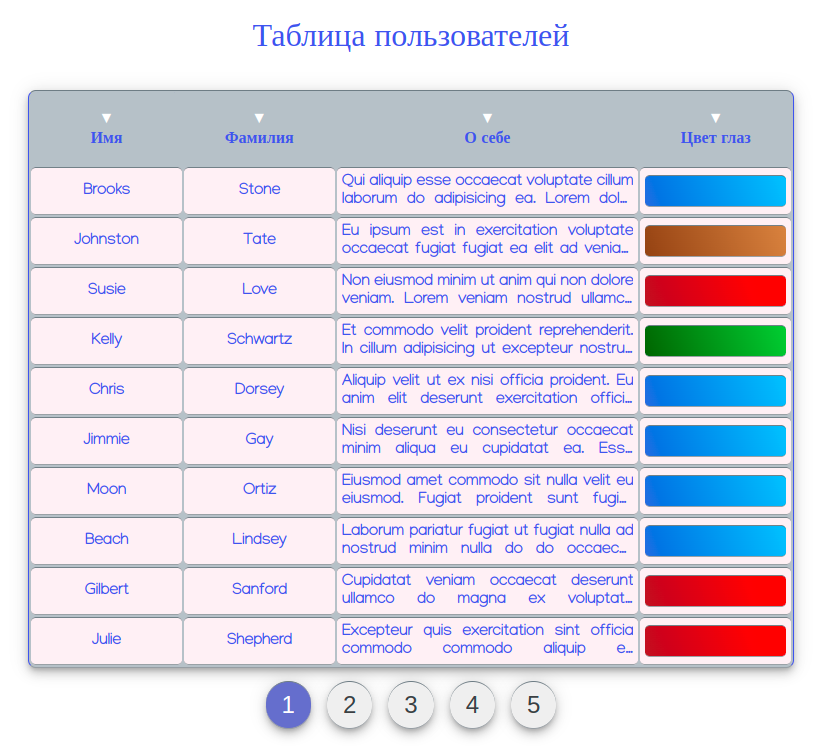
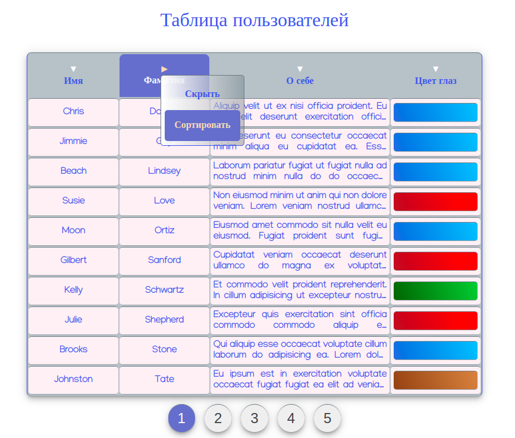
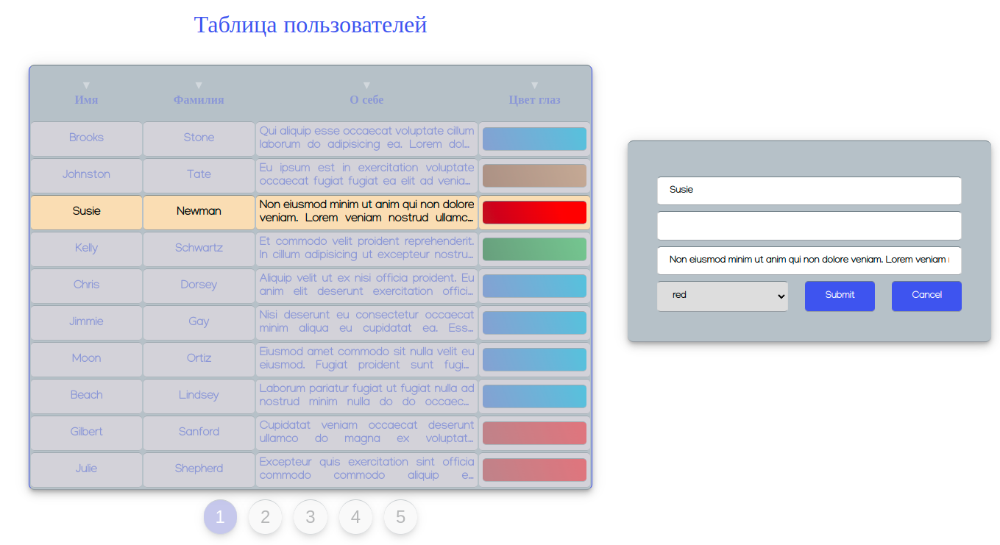

## Таблица пользователей:

- Создана таблица с четырьмя колонками:
  - Имя
  - Фамилия
  - О себе
  - Цвет глаз
- Данные для таблицы взяты из JSON файла;
- Каждая колонка в таблице имеет свойство сортировки;
- В столбце "О себе" данные выводятся не полностью, а только в 2 строки;
- При клике на ячейку появляется форма редактирования строки;
- Таблица появляется на странице по 10 записей;
- Имеются кнопки для перелистывания страниц.

Ссылка на [gh-pages](https://elviracher.github.io/users-table/)

#### Так выглядит таблица, она занимает 50% страницы (на данном скриншоте это непонятно) :

#### Ecть возможность сортировки в алфавитном порядке и скрытия данных конкретного столбца

#### Форма редактирования отображается в соседнем с таблицей 'div-e', при этом клик по другим областям страницы заблокирован до момета скрытия формы

